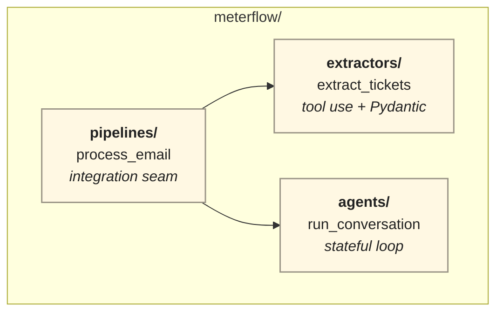
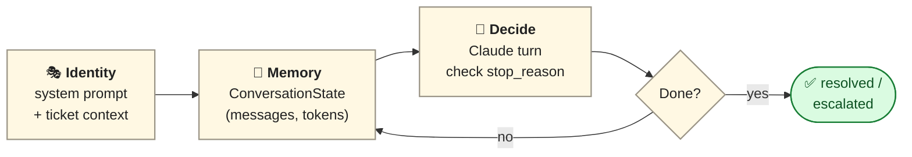

# I built a multi-agent support system in 6 days — what I'd change

A daily constraint: ship one runnable piece every day on top of the same application. The result processes customer emails end-to-end. Total cost for a test run of three emails: **$0.015** on Claude Haiku 4.5.

## What it does

```
📧  Customer email
       ↓
🎯  Extract N tickets   (tool use + Pydantic)
       ↓
📋  Sort by severity
       ↓
💬  Resolution agent × N (stateful conversation loop)
       ↓
📊  BatchResult (cost, resolved, errored)
```

## How it's organized

A small Python package, three modules. The pipeline is the only entry point; the extractor and agents are reusable units underneath it.



## What makes it "agentic"

Each Resolution Agent isn't a single API call — it's a loop that owns its own state and decides when it's done. Four pieces, every turn:



The agent has an identity (system prompt), memory (the conversation state), a decision step (Claude reads context + decides what to say or do next), and a stop condition. Without all four, it's just a chat completion — not an agent.

## Three things that mattered

- **`stop_reason` is the universal completion signal.** Every retry, every "did the model finish?" check branches on it.
- **Role alternation is a client-side discipline, not an API contract.** The Messages API silently accepts two consecutive user turns. Your loop is the only thing that keeps the conversation coherent.
- **Tool use is structured output's other right answer.** When the shape is a list or strict, use a tool with `input_schema` derived from your Pydantic model.

## What surprised me

- **The agent kept asking for info the system prompt already gave it.** Fixed by declaring the embedded fields as authoritative in one paragraph.
- **End-to-end resolution rate on the marquee case: 1/3.** Auth and quota scripts closed ambiguously and the agent kept asking clarifying questions. The kind of finding an eval suite catches; I don't have one yet.

## What I'd change

- **Start with `list[Ticket]` from day one.** Single-object contracts had to be retrofitted when multi-issue emails arrived.
- **Use tool use as the resolution signal**, not a `[RESOLVED]` sentinel parsed with regex.
- **Build prompt caching in from the start.** The agent system prompt was recomputed every turn — caching would have cut ~70% of input cost.

## What's next

Prompt caching, MCP server for the extraction tool. Target: cut $0.015 to under $0.005 for the same workload.

— Shweta
