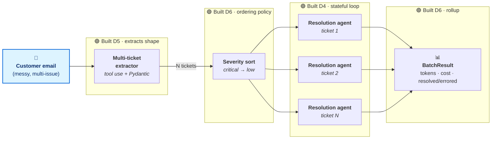

# 🗺️ MeterFlow SupportOps — Week 1 Story

> **A 6-day build of a multi-agent customer support pipeline.**
> What it does: turn one messy customer email into resolved support tickets, automatically.
> Built day by day as exam prep for Anthropic's CCA-F architect certification.

---

## 📊 What it does, in 3 numbers

<table>
<tr>
<th align="center" width="33%"><h1 style="margin:0">3</h1>customer emails<br><sub>processed end-to-end</sub></th>
<th align="center" width="33%"><h1 style="margin:0">4</h1>tickets extracted<br><sub>severity-sorted, fanned out</sub></th>
<th align="center" width="33%"><h1 style="margin:0">$0.015</h1>total spend<br><sub>across all model calls</sub></th>
</tr>
</table>

---

## 🛠️ The system — one diagram, one story

The pipeline takes one inbound email and resolves every issue inside it. Each node below was built on a specific day; together they form a runnable system. **Read it left-to-right.**



**Foundation days that don't appear as nodes but make everything above possible:**
🔧 **D1** API basics + `stop_reason` · 🧠 **D2** `system` prompts + XML output · 🎯 **D3** single-ticket extraction (Day 5 replaced it with the multi-ticket version above)

---

## 📈 Where I am in the curriculum

```
   Week 1            Week 2          Week 3           Week 4         Week 5         Week 6
   ─────────         ──────────      ──────────       ──────────     ──────────     ──────────
   ██████████        ░░░░░░░░░░      ░░░░░░░░░░       ░░░░░░░░░░     ░░░░░░░░░░     ░░░░░░░░░░
   Foundations       MCP +           Multi-agent      Reliability    Evals +        Full system
   ✅ done           prompt caching  research         + Claude Code  polish         exam-shaped
                     ← Day 7 next
```

**6 / 36 days complete · 17% through · all 5⭐ days · no skipped days**

---

## 💡 The one rule that mattered most this week

> ### Anything you parse → demand structure.
> XML tags, JSON Schema, or a tool call — pick one, then **enforce the same schema on both sides**: in the prompt (so the model knows what to emit) and in code (so unsigned input never reaches the routing layer).
>
> Why this rule dominates: every other Week 1 lesson is downstream of it. The conversation loop needs a structured `SupportTicket` to know what it's resolving. The pipeline can't sort by severity if `severity` is a string we hope the model returns. The cost-tracking property on `BatchResult` can't fire if the conversations don't have typed token counts. **Lose the structure, lose the system.**

---

## 🎯 What's next

**Day 7 — prompt caching on the support agent's system prompt.** The Day 4 system prompt (with the `<ticket>` block embedded) is recomputed on every conversation turn. Adding `cache_control` should cut input-token cost ~70% on the multi-turn cases. Concrete savings target: $0.015 → ~$0.006 to re-run the same Week 1 capstone.

---

<details>
<summary>📦 <strong>Details for the curious</strong> — code layout, lesson list, anti-patterns, backlog</summary>

<br>

### 🏗️ Where the code lives (`meterflow/` package)

```
meterflow/extractors/     ←  D3 (single) + D5 (multi)  · SupportTicket, extract_tickets()
meterflow/agents/         ←  D4                        · ConversationState, run_conversation()
meterflow/pipelines/      ←  D6                        · BatchResult, process_email()
week1/wNdN_*.py           ←  thin runnable demos that exercise the modules above
```

### 📏 All six rules absorbed this week

| # | Rule | Day |
|---|------|-----|
| 1 | Persona goes in `system`, never in user messages | D2 |
| 2 | Anything you parse → demand structure (XML, JSON Schema, tool use) | D3 |
| 3 | `temperature=0` for any task whose output you parse or route on | D3 |
| 4 | Role alternation is a client-side contract (API silently accepts broken shape) | D4 |
| 5 | Tool use is structured output's other right answer (use it for lists & strict shapes) | D5 |
| 6 | Batch processing needs per-item isolation (one bad ticket ≠ dead batch) | D6 |

### 📚 Anti-pattern bank — 19 entries across 4 domains

| Domain | Exam weight | Entries this week | Coverage |
|--------|:-----------:|:-----------------:|:--------:|
| 🧠 Prompt Engineering | 20% | 4 | strong |
| 🔧 Tool Design & MCP | 18% | 4 | strong |
| 🏗️ Agentic Architecture | 27% | 6 | strong |
| 📊 Context Mgmt & Reliability | 15% | 3 | partial |
| 💻 Claude Code | 20% | 0 | not yet (Week 4) |

Master file regenerated from per-day files at `notes/anti-patterns.md` — never hand-edit it.

### 🔎 Backlog — open findings I chose to defer, not blockers

| Found on | Finding | When to fix |
|----------|---------|-------------|
| D6 | `triple_issue` resolved 1/3 — auth + quota scripts close ambiguously, agent over-asks | Day 19 (reliability + eval harness exist by then) |
| D5 | No test of malformed bodies (binary, very long text). Empty body works. | Week 4 fuzz pass |
| D4 | First-draft claim about server-side role-alternation enforcement was wrong; corrected mid-session | Already fixed in `notes/W1D4/anti-patterns.md` |

</details>
